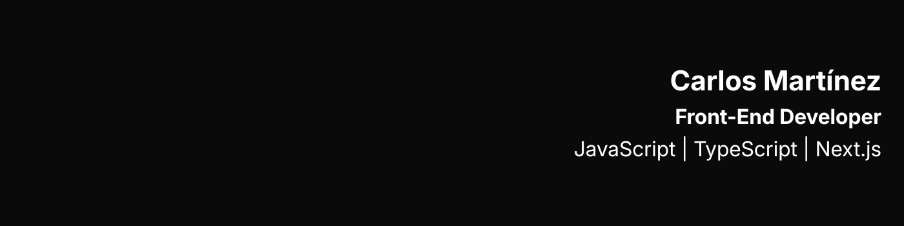

# About

Front-End Developer experienced in Next.js, JavaScript, and TypeScript, focused on building scalable web interfaces and translating Figma designs into high-fidelity UI using front-end best practices.

## GitHub Stats

