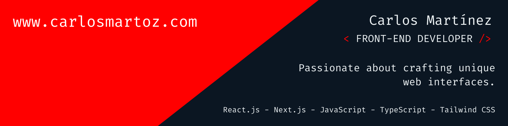

# 📕 About

Front-End Developer with 3 years of experience specializing in creating and designing user interfaces for the web using technologies such as React.js, Next.js, JavaScript, TypeScript, and Tailwind CSS. I also have experience using Figma for interface design.

I am always eager to learn new technologies, have strong communication skills, and excel both in team settings and working independently.

## 📌 Pinned Repositories

   

   

## 📈 GitHub Stats

## 💼 Main Skills

## 💼 Additional Skills

